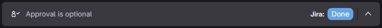
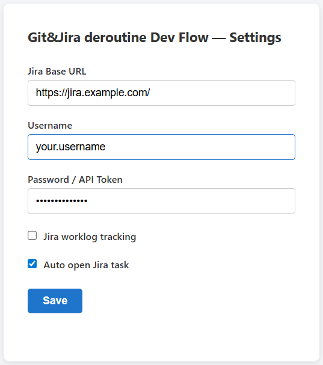

# Git&Jira deroutine Dev Flow

Chrome extension that streamlines developer workflow between GitLab and Jira.

## Features

- **One-click Jira status update** - from GitLab MR pages (Code review / Releases)

- **Automatic worklog tracking** - distributes time across linked issues

## Setup
1. Install Chrome extension from [Chrome Web Store (Will be later maybe)](https://chromewebstore.google.com/detail/TODO) or load unpacked from source
2. Open extension settings and configure your Jira instance URL, username, or API token

## Button Visibility Rules

| Button | MR Status | Target Branch |
|---|---|---|
| CodeReview | Open | develop |
| Bugfix | Open | develop |
| Internal Test | Merged | develop |
| Test Control | Merged | stage |
| Done | Merged | master |

> TODO: add configurable rules in settings

## Privacy

This extension:
- Stores Jira credentials locally in `chrome.storage.local` (never transmitted to third parties)
- Communicates only with your configured Jira instance
- Does not collect analytics or telemetry

## Contributing

Contributions are welcome! Please open an issue or submit a pull request on GitHub.

## License

MIT
